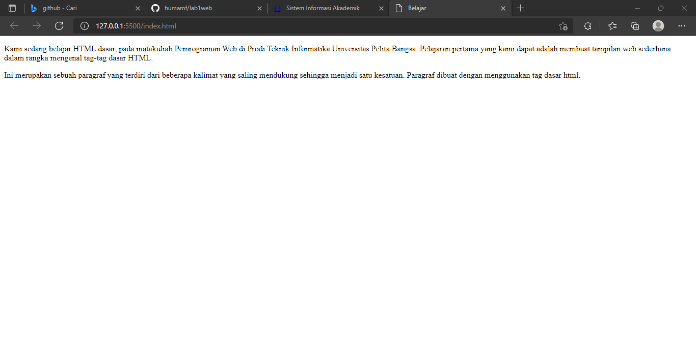
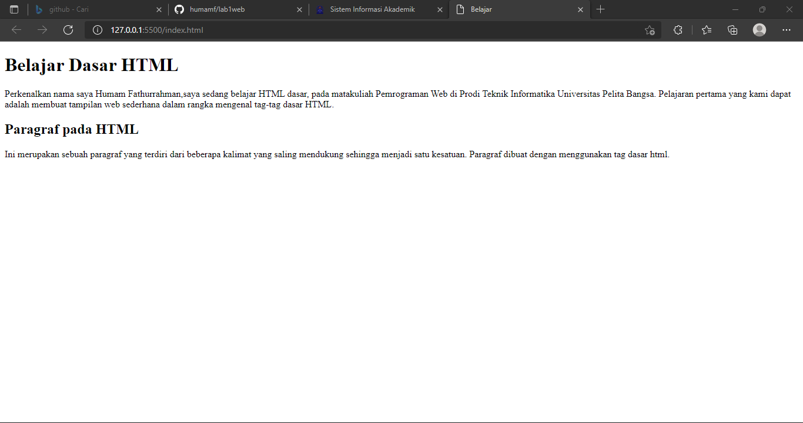
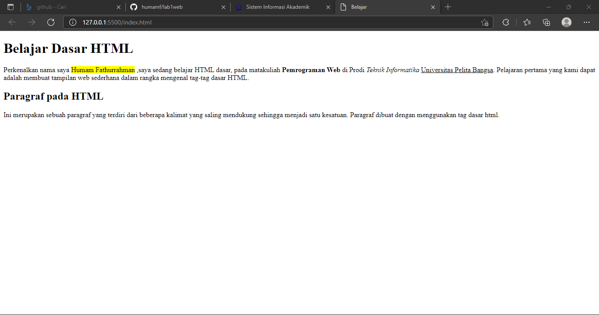
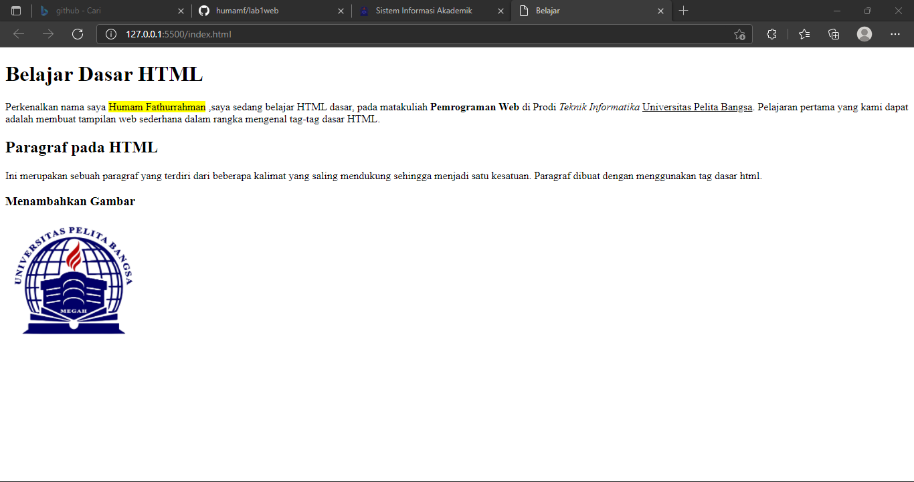
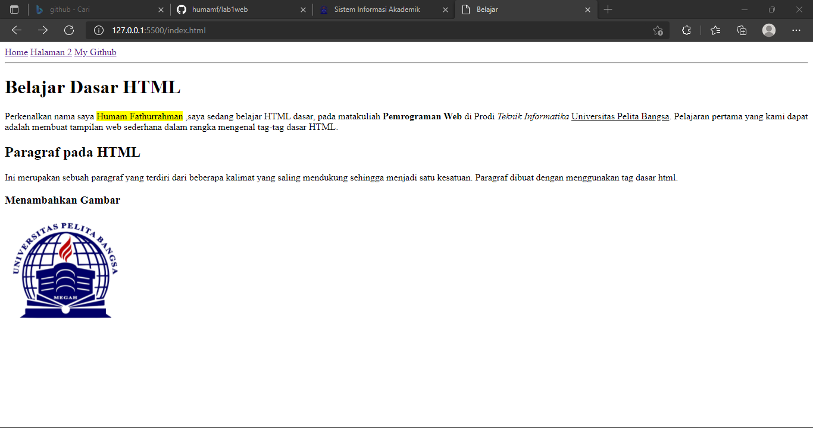

# Tugas HTML

## Paragraf
 
Menggunakan tag 
 untuk membuat paragraf.

## Heading

Heading atau Judul menggunakan tag <h1> terbesar sampai <h6> terkecil.

## Memformat teks

Membuat variasi didalam paragraf dengan memberi background color pada kalimat tertentu, jika ingin menebalkan kata menggunakan tag <b>, tulisan miring menggunakan tag <i>, garis bawah menggunakan tag <u>.

## Menambahkan Logo UPB

Untuk menambahkan foto dengan menggunakan tag  dan cari file sesuai pada penyimpanan 

## Menambahkan Hyperlink

Untuk menambahkan link yang ingin anda taruh di web dengan menggunakan tag <a> 