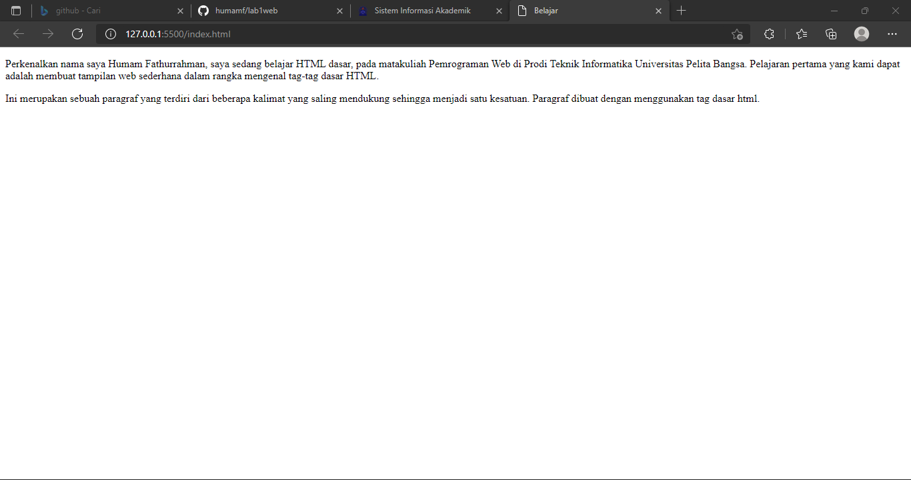

# Praktikum 1

## 1.Membuat Paragraf
Membuat 2 paragraf menggunakan tag ``` <p></p> ```
```
<!-- Ini adalah paragraf pertama -->
<p>Perkenalkan nama saya Humam Fathurrahman ,saya sedang belajar HTML dasar, 
pada matakuliah Pemrograman Web di Prodi Teknik Informatika Universitas Pelita Bangsa. 
Pelajaran pertama yang kami dapat adalah membuat tampilan web sederhana dalam rangka 
mengenal tag-tag dasar HTML.</p>
<!-- Ini adalah paragraf kedua -->
<p>Ini merupakan sebuah paragraf yang terdiri dari beberapa kalimat yang saling mendukung
 sehingga menjadi satu kesatuan. Paragraf dibuat dengan menggunakan tag dasar html.</p>
```

Maka akan tampil sebagai berikut
 


## 2.Menambahkan Judul atau Heading
Menambahkan judul atau heading dengan menggunakan tag ```<h1>``` (terbesar) sampai ```<h6>``` (terkecil)
```
<!-- judul paragraf pertama -->
    <h1>Belajar Dasar HTML</h1>
<!-- judul paragraf kedua -->
    <h2>Belajar Dasar HTML</h2>
```
Maka akan tampil sebagai berikut


## 3.Menambahkan Format teks
Menambahkan format dengan menggunakan tag ```<b>, <i>, <u>```

Maka akan tampil sebagai berikut


## 4.Menambahkan Logo UPB
Menambahkan foto menggunakan tag ``````
```
<!-- menambahkan gambar pada dokumen -->
    
```
Maka akan tampil sebagai berikut


## 5.Menambahkan Hyperlink
Menambahkan Hyperlink menggunakan tag ```<a>```
```
<nav>
    <a href="">Home</a>
    <a href="halaman2.html">Halaman 2</a>
    <a href="https://github.com/humamf/lab1web">My Github</a>
</nav>
<hr>
```
Maka akan tampil sebagai berikut

